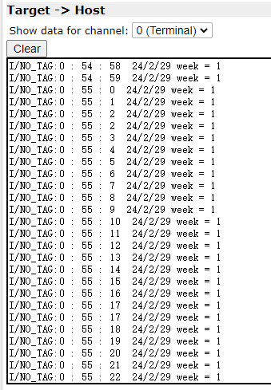
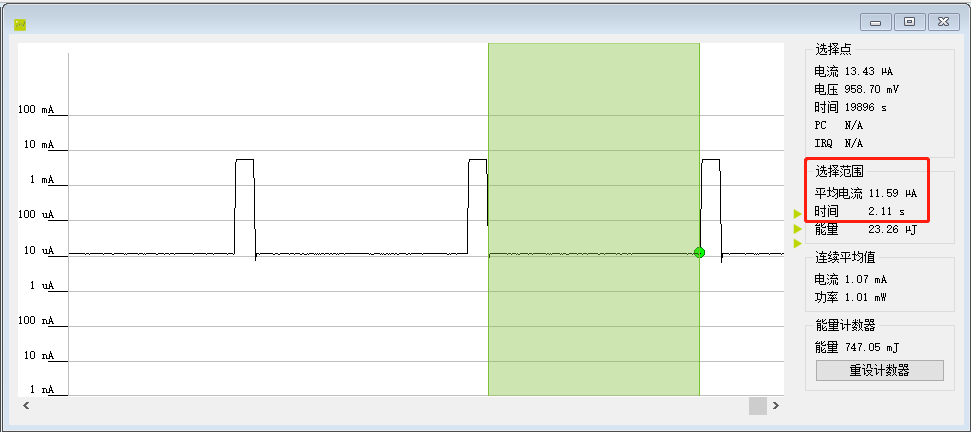

RTC（万年历）使用示例
======================

例程路径：<install_file>/dev/examples/rtc_test

一、程序基本配置及说明:
-------------------------
rtc示例程序包括三个功能配置：万年历测试，LP0模式下RTC唤醒测试和LP2模式下RTC唤醒测试

1.1 万年历测试
+++++++++++++++++
配置#define RTC_TEST_CASE 1
该测试是针对RTC内部硬件万年历功能。程序的大致流程，是将万年历初始化为一个具体的日期/时间，之后定时获取万年历运行结果。

1.2 RTC唤醒测试（LP0模式）
+++++++++++++++++++++++++++
配置#define RTC_TEST_CASE 2
该测试是针对LP0模式下RTC唤醒系统功能。在系统初始化之后，程序会配置RTC wakeup中断，配置唤醒时间为2秒，之后系统会马上进入sleep，2秒后RTC唤醒系统，并进入中断callback函数，点亮LED，之后系统会自动再次进入LP0休眠模式，等待RTC下一次唤醒系统

1.3 RTC唤醒测试（LP2模式）
+++++++++++++++++++++++++++
配置#define RTC_TEST_CASE 3
该测试是针对LP2模式下RTC唤醒系统功能。类似于LP0模式RTC测试，程序会在系统初始化完成后配置RTC wakeup中断，唤醒时间2秒，之后在STACK_READY消息里会检查当前系统唤醒的唤醒源，如果是RTC唤醒则会点亮测试板的LED（PA01），之后进入LP2休眠模式，等待RTC下一次唤醒系统

二、操作步骤及结果:
---------------------

将编译好的程序下载到测试的模块中。

   **注意：烧录时如果系统处于运行休眠唤醒流程里，需要将PB14拉高后重新上电再烧录**

2.1 万年历测试
++++++++++++++++
连接RTT，可以看到程序跑起来之后每隔大概2秒钟左右会有一条打印输出，显示万年历信息。预期结果如下：

2.2 RTC唤醒测试（LP0模式）
+++++++++++++++++++++++++++
通过监测系统功耗，可以看到系统处于定期唤醒的LP0模式（sleep功耗 **10uA** 左右），同时测试板的LED灯会定期闪烁。预期结果如下：

2.2 RTC唤醒测试（LP2模式）
+++++++++++++++++++++++++++
通过监测系统功耗，可以看到系统处于定期唤醒的LP2模式（sleep功耗 **1uA** 左右），同时测试板的LED灯会定期闪烁。预期结果如下：

..  image:: RTC_wkup_LP2_test_result_expected.png
