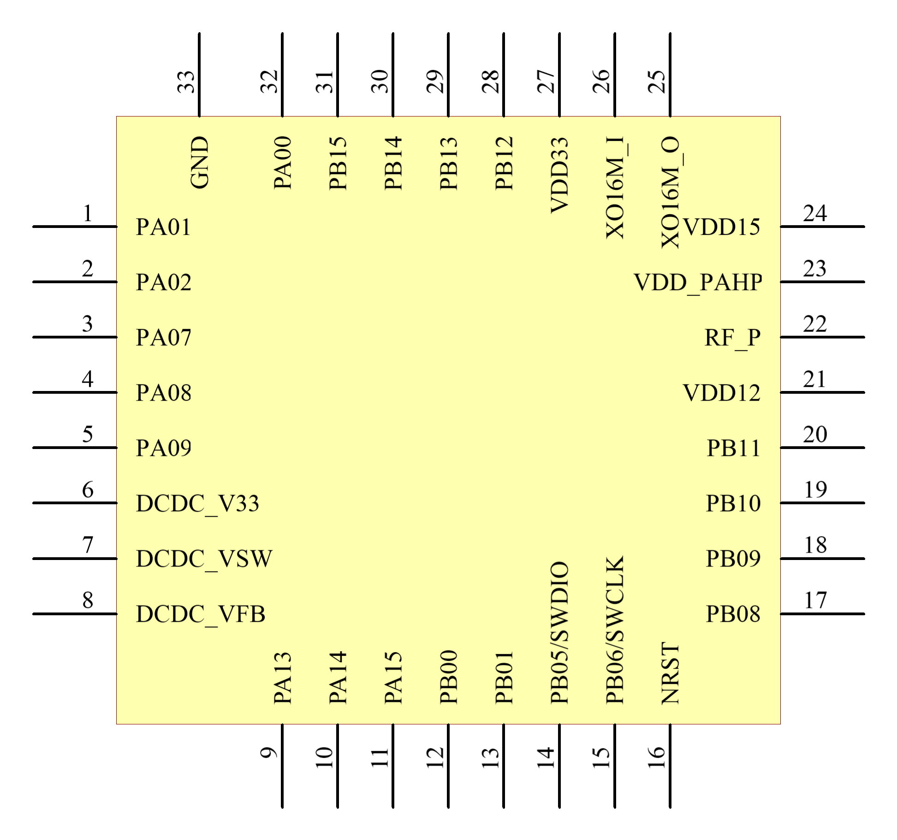
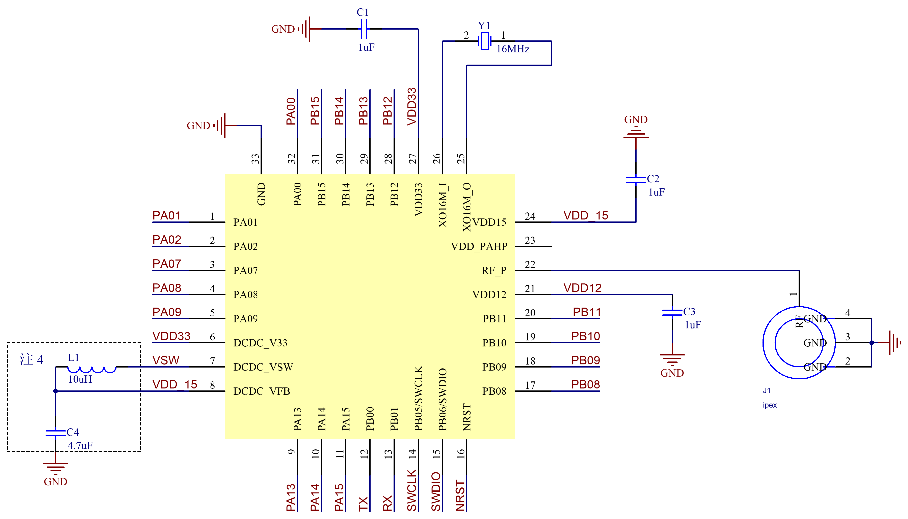

======================
硬件开发使用使用手册 
======================

--------------
一、 芯片简介 
--------------

+++++++++++++
1.1 功能介绍
+++++++++++++

LE5010芯片支持天猫mesh，有19 个外置I/O，供电电压在1.7V-3.6V，可以使用干电池或者对应电压的锂电池供电。

+++++++++++++++
1.2 引脚定义图
+++++++++++++++

GPIO 具有全功能映射。

管脚定义：

========  ========  =======
引脚编号   名称     功能
========  ========  =======
1         PA01       IO
2         PA06       IO
3         PA07       IO
4         PA08       IO
5         PA09       IO
6         DCDC_V33   DCDC_V33
7         DCDC_VSW   DCDC输出
8         DCDC_VFB   DCDC反馈输入
9         PA13       IO
10        PA14       IO
11        PA15       IO
12        PB00       IO /UART1_TX
13        PB01       IO /UART1_RX
14        PB05       IO /SWCLK
15        PB06       IO /SWDIO
16        NRST       IO
17        PB08       IO
18        PB09       IO
19        PB10       IO
20        PB11       IO
21        VDD12      1.2V电源
22        RF_P       ANT
23        VDD_PAHP   RF滤波
24        VDD15      1.5V电压输入，与PIN8相接
25        XO16M_O    晶振接口0
26        XO16M_I    晶振接口1
27        VDD33      3.3V电源接口、与PIN6相接，再接电源
28        PB12       IO
29        PB13       IO
30        PB14       IO
31        PB15       IO
32        PA00       IO
33        GND        GND
========  ========  =======

-------------------
二、参考系统设计
-------------------

+++++++++++++++++++
2.1 量产系统
+++++++++++++++++++

注 ：

1、NRST为复位引脚，默认为高，输入低电压时，产生复位信号

2、PB00和PB01上电后默认为UART1的TX、RX接口，可在程序中更改功能

3、在使用UART烧录时，需要将PB14强制拉高

4、若未使用DCDC降低功耗，将L1换成0欧电阻，C4电容可省略

5、如果未使用大PA（TX功率在10dBm以下），则C5电容可省略

sch_CN  :download:`sch <./PAGE.pdf>` 
sch_EN  :download:`sch<./PAGE_EN.pdf>`
PcbLib  :download:`pcblib<./LE5010_QFN32.PcbLib>`
