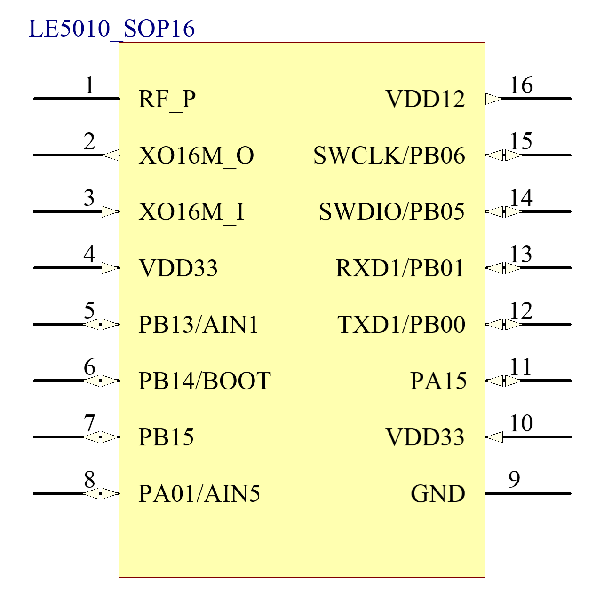
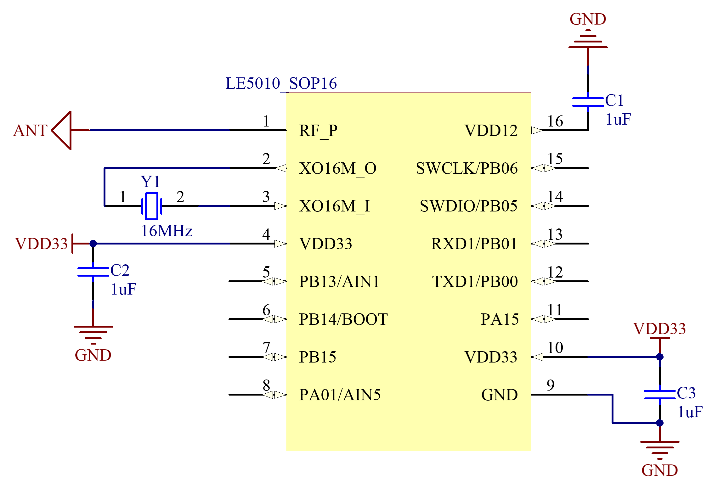

======================
硬件开发使用手册 
======================

--------------
一、 芯片简介 
--------------

+++++++++++++
1.1 功能介绍
+++++++++++++

LE5010芯片支持SIG MESH和私有MESH，供电电压在1.8V-3.6V，可以使用干电池或者对应电压的锂电池供电。

+++++++++++++++
1.2 引脚定义图
+++++++++++++++

*QFN32*

..  image:: LE5010_QFN32_IO.png

GPIO 具有全功能映射。

QFN32管脚定义：

========  ========  =======
引脚编号   名称     功能
========  ========  =======
1         PA01       IO /ADC5
2         PA02       IO /ADC6
3         PA07       IO
4         PA08       IO
5         PA09       IO
6         DCDC_V33   DCDC 3.3V供电电源
7         DCDC_VSW   DCDC输出
8         DCDC_VFB   DCDC反馈输入
9         PA13       IO
10        PA14       IO
11        PA15       IO
12        PB00       IO /UART1_TX
13        PB01       IO /UART1_RX
14        PB05       IO /SWDIO
15        PB06       IO /SWCLK
16        NRST       复位引脚
17        PB08       IO
18        PB09       IO
19        PB10       IO
20        PB11       IO
21        VDD12      1.2V电源
22        RF_P       ANT
23        VDD_PAHP   PAHP电源 1_
24        VDD15      1.5V电源输入
25        XO16M_O    晶振接口
26        XO16M_I    晶振接口
27        VDD33      3.3V供电电源
28        PB12       IO /ADC0
29        PB13       IO /ADC1
30        PB14       IO 
31        PB15       IO 
32        PA00       IO /ADC4
33        GND        GND
========  ========  =======

**注：**  

_`1`、PAHP电源，TX功率大于10dBm时，需要在VDD_PAHP(PIN23)外部添加一个1uF的滤波电容

*SOP16*

GPIO 具有全功能映射。

SOP16管脚定义：

========  ========  =======
引脚编号   名称      功能
========  ========  =======
1         RF_P       ANT
2         VDD_REG    3.3v输入
3         XO16M_O    晶振接口
4         XO16M_I    晶振接口
5         VDD33      3.3V电源输入
6         PB14       IO
7         PB15       IO
8         PA01       IO /ADC5
9         GND        GND
10        PA08       IO
11        PA09       IO
12        PB00       IO /UART1_TX
13        PB01       IO /UART1_RX
14        PB05       IO /SWDIO
15        PB06       IO /SWCLK
16        VDD12      1.2V电源
========  ========  =======

-------------------
二、参考系统设计
-------------------

QFN32

..  image::  Mass_schematic.png

**注：**

| *1、 NRST为复位引脚，低电平复位*
| *2、 PB00和 PB01上电后默认为 UART1的 TX、RX接口，可在程序中更改功能*
| *3、 在使用 UART烧录时，需要将 PB14强制拉高*
| *4、 若未使用 DCDC降低功耗，将 L1换成0欧电阻，C4电容可省略*
| *5、 若使用时，TX功率在10dBm以上，需要在 VDD_PAHP(PIN23)外围加一个1uF的电容*
| *6、 芯片的PIN8(VFB)和PIN24(VDD15)都是输入引脚，在PCB上需要接到一起。VDD12为电源引脚，需要外挂电容。*

BOM表：

================  ================================      =======  =======
位号                       封装规格                       数量     备注
================  ================================      =======  =======
U1                      LE5010(QFN32 4*4)                  1        
Y1                      16MHZ 10PPM 9pF/3225               1       泰晶
C5                      (±10%)/10V/4.7uF/0402              1 
C1、C2、C3、C4          (±10%)/10V/1uF/0402                4 
L1                      (±10%)/100mA/10uH/0603             1 
================  ================================      =======  =======

SOP16

**注：** 

| *1、 PB00和 PB01上电后默认为 UART1的 TX、RX接口，可在程序中更改功能*
| *2、 在使用 UART烧录时，需要将 PB14强制拉高*

BOM表：

================  ================================      =======      ==========
位号                       封装规格                       数量         备注
================  ================================      =======      ==========
U1                      LE5010(SOP16)                      1 
Y1                      16MHZ 10PPM 9pF/3225               1           泰晶
C1、C2、C3              (±10%)/10V/1uF/0402                3
================  ================================      =======      ==========

-------------------
三、封装尺寸
-------------------

外形尺寸：

**QFN32尺寸图**

..  image::  LE5010_QFN3_Size.png

**SOP16尺寸图**

..  image::  SOP16.png

QFN32_SCH  :download:`CN <./LE5010_QFN32_CN.pdf> EN <./LE5010_QFN32_EN.pdf>`

SOP16_SCH  :download:`CN <./LE5010_SOP16_IO.pdf>`

AD_PCB  :download:`LE5010_QFN32_PCB <./LEM5010.PcbDoc>` 

 